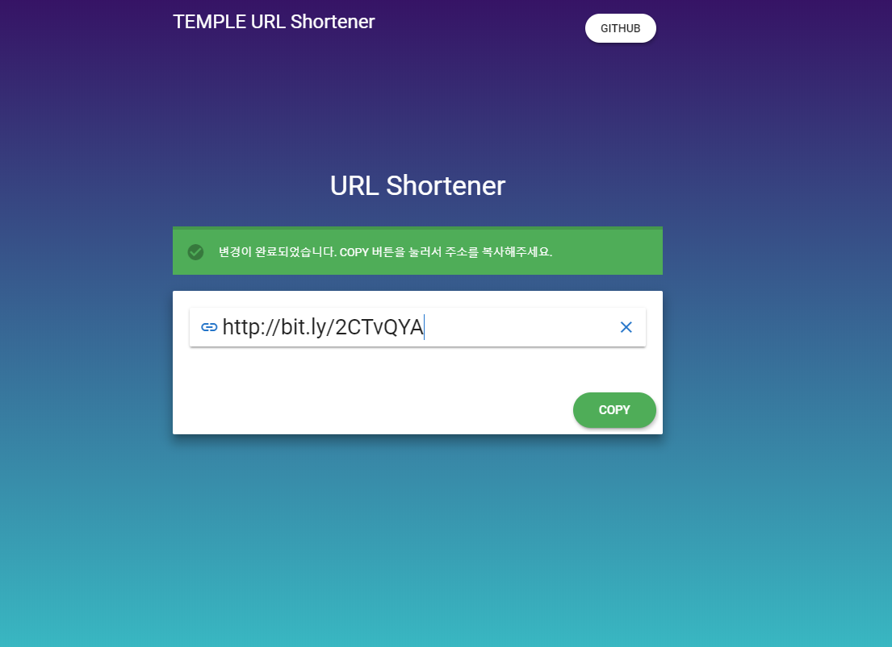

# vue-shortener

## Project Structure

```bash
vue-shortener
├── README.md
├── clint (Vue CLI 3)
│   ├── package.json
│   ├── public
│   └── src # Vue Compnents
└── server (Slim Framework)

```

## How to run

```bash

```

## Preview


